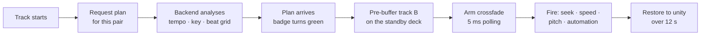

# AuraVibe

A music player that mixes, rather than just plays. Consecutive tracks are tempo-matched,
beat-aligned and crossfaded on the bar line — the kicks land on top of each other instead of
flamming past each other.

**Flutter** · Android / Windows / Linux · audio engine: [SoLoud](https://pub.dev/packages/flutter_soloud)

> **This repository is the player half of a two-part system.** It is a *client*: it holds the
> audio engine, the UI, and the crossfade executor, but every transition it performs is planned
> by a companion DSP backend (`another-dsp`, a separate Python/FastAPI service) that is **not**
> included here. Without that server running, search, playback and automix are all unavailable —
> see [Requirements](#requirements).

---

## What it does

| | |
|---|---|
| **Automix** | Beat-matched, DSP-planned transitions between queued tracks — tempo sync, beat alignment, equal-power crossfade, bass handover, loudness matching |
| **Discover** | Trending playlists and artists, browsable artist / album / playlist pages |
| **Search** | Tracks, albums, artists and playlists, with filters |
| **Library** | Favorites and custom playlists, stored locally on the device |
| **Playback** | Persistent mini player, full Now Playing screen with album-art-driven color, queue management |
| **Background playback** | On Android, a `mediaPlayback` foreground service with notification and lock-screen transport controls, so leaving the app does not stop the music — or strand a transition mid-blend |

The interface language is Turkish. The codebase is English.

---

## How automix works

The player deliberately makes **no mixing decisions of its own**. The backend analyses both
tracks and returns a plan — where to start the blend, how long it runs, what speed each deck
runs at, and a list of timestamped volume and filter automation events. The player's job is to
execute that plan on the sample-accurate clock the backend cannot see.



Two decks are always live. While track A plays, track B is decoded and buffered on a silent
standby deck, so the blend never waits on the network.

### The parts that were hard

**Trigger resolution.** SoLoud reports playback position once per mix block — 2048 frames, about
46 ms. Firing a beat-aligned crossfade on that grid means being up to 46 ms late, which is
audible as a flam. Each deck's position is therefore anchored to a `Stopwatch` on every observed
change and interpolated between updates, and the crossfade is armed on a **5 ms** poll. Whatever
overshoot remains is measured and compensated in the seek.

**Entry correction.** Track B's entry point is corrected once more *after* it starts, while it is
still inaudible: the two decks' real reported positions are compared and B is re-seeked before
its volume ramp begins. Errors below 2 ms are ignored; above 150 ms the correction is refused
rather than trusted.

**Pitch compensation.** Beat-matching by resampling changes pitch. Beyond about 6% — one
semitone — that is unacceptable, so a per-bus phase vocoder cancels the shift, which is what
lets the backend stretch up to 15% instead of 6% and match far more pairs. Below that threshold
the shifter stays out of the path entirely: the decision is made once, at fire time, and the
compensation is tracked back down during the post-blend restore so the pitch never steps.

**Loudness.** Matching every track to an absolute LUFS target quietly attenuated *everything*.
Instead, loudness is matched **pair-relative** — track A is never touched, track B is nudged to
meet it by at most 6 dB — and a global limiter provides the headroom. Enabling automix therefore
never makes playback quieter than leaving it off.

**Never re-pitching the outgoing track.** Only the incoming track warps onto the one already
playing. Meeting in the middle would mean audibly bending a track the listener is already
hearing.

---

## Measured

Transition quality is verified offline rather than by ear alone: plans are rendered to PCM by a
harness on the DSP side and the result is measured.

| | |
|---|---|
| Kick alignment at the blend | **~9 ms** median, 90–92% within 25 ms |
| Drift across the blend | ~1.5 ms |
| Tempo estimation | 76.7% (GiantSteps, Accuracy1) |
| Key estimation | 53.8% exact, 74.0% Camelot-compatible |

These are measured on rendered transitions, not on-device output. Real hardware execution error
is logged by [`AutomixLog`](lib/services/automix_log.dart) but has not yet been characterised.

---

## Requirements

- **Flutter** 3.47+ / Dart 3.13+
- **`another-dsp`** — the companion backend, reachable over HTTP. It serves the catalog, resolves
  stream URLs, and plans transitions. Its address is configured in-app under Settings and
  defaults to `http://127.0.0.1:8000`.

The player talks to exactly one server; there is no second address to configure.

## Building

```bash
flutter pub get
```

Run on a connected device or desktop:

```bash
flutter run -d android
```

### Android

Build one APK per ABI rather than a single fat one:

```bash
flutter build apk --split-per-abi
```

This matters more than usual here. `ffmpeg_kit` ships prebuilt native libraries for every ABI,
and `--target-platform` does not restrict them — only Flutter's own libraries. A combined
release APK is ~197 MB, of which roughly two thirds is native code for architectures the target
device cannot run. Split per ABI, the arm64 build is ~64 MB.

Release builds are currently signed with the **debug** keystore (the Flutter template default).
Fine for sideloading; replace it before distributing.

### Linux

`linux/CMakeLists.txt` sets `TRY_SYSTEM_LIBS_FIRST` and an `$ORIGIN` rpath. Without these,
`ffmpeg_kit`'s bundled libraries are linked ahead of the system ones and the app fails at
runtime with a GLIBC version error when it tries to `dlopen(libffmpegkit.so)`.

---

## Project layout

```
lib/
├─ main.dart                    Composition root — everything is constructed here
├─ controllers/
│  ├─ player_controller.dart    Playback state; hands ready plans to the audio service
│  └─ managers/                 Queue, library, and automix plan lifecycle
├─ services/
│  ├─ soloud_audio_service.dart Dual-deck engine, crossfade executor  ← the substance
│  ├─ automix_service.dart      Plan + health endpoints
│  ├─ catalog_service.dart      Search, artists, albums, playlists, charts
│  ├─ stream_service.dart       Video id → playable CDN URL
│  ├─ storage_service.dart      Settings and local library persistence
│  ├─ media_session.dart        Foreground service / lock-screen bridge (Android)
│  └─ automix_log.dart          Transition telemetry to a collectable file
├─ models/
│  └─ transition_plan.dart      Mirrors the backend's plan schema
├─ screens/                     Home, Search, Library, Now Playing, Settings, detail pages
├─ widgets/                     Mini player, automix badge, queue sheet, glass surfaces
└─ theme/app_theme.dart         Dark-first palette, Manrope + Inter pairing
```

Dependency injection is manual and explicit — services are constructed in `main.dart` and passed
down. There is no service locator and no global state.

---

## Settings

| Setting | Default | Effect |
|---|---|---|
| DSP server address | `http://127.0.0.1:8000` | The single backend the app talks to |
| Automix | Off | Enables health polling, plan fetching, and beat-matched transitions |
| Time stretching | On | Allows up to 15% tempo stretch with pitch compensation instead of 6% without. Widens how many pairs can be beat-matched, at the cost of running a phase vocoder on the incoming deck |

The automix badge reflects real state: red when the server is unreachable, yellow while a plan
is being computed, green with the target BPM and key once one is ready.

---

## Known limitations

- **Android, Windows and Linux only.** No iOS, macOS or web targets are configured.
- **The backend is required and not included.** This repository does not build into a working
  app on its own.
- Release builds are debug-signed.
- **Audio focus is not handled.** Playback does not duck for notifications or pause for an
  incoming call — the media session publishes state and accepts transport commands, but nothing
  yet listens for focus loss.
- No light theme — the design was built dark-first.
- `ffmpeg_kit_flutter_new` still applies the Kotlin Gradle Plugin the old way. It builds today
  with a warning; future Flutter versions will refuse it.
